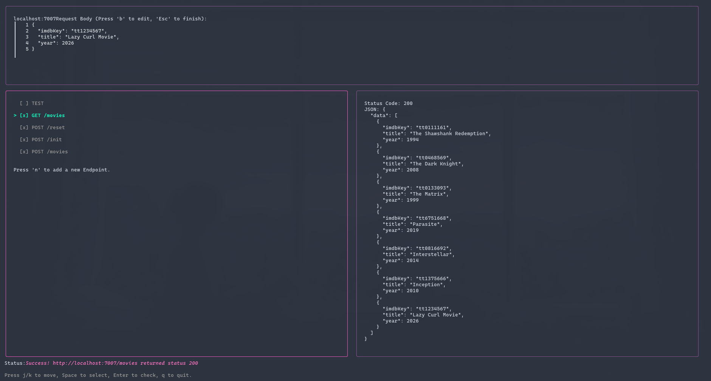

# Lazy Curl

Lazy Curl (`lazy-curl`) is a fast & easy, terminal-based (TUI) REST API client.

Built as a lightweight alternative to heavy graphical clients like Postman and a more user-friendly alternative to complex `curl` commands, `lazy-curl` brings a multi-pane, interactive graphical interface directly to your terminal.



## Features

- **Interactive Multi-Pane UI:** Navigate effortlessly between your Request Configuration, Endpoint List, and Server Response panes.
- **Dynamic HTTP Methods:** Easily toggle between `GET`, `POST`, `PUT`, `PATCH`, and `DELETE` without typing them out manually.
- **Smart URL Construction:** Define a Base URL once and quickly test multiple endpoints against it.
- **Auto-Formatting JSON Body:** Type your payload into the built-in text area. When you finish, `lazy-curl` automatically validates, formats, and pretty-prints your JSON.
- **Responsive Layout:** Built with Charm `bubbletea`, the UI dynamically resizes to perfectly fit your terminal window and leaves your shell history completely clean when you exit.

## Installation & Setup

You will need [Go](https://go.dev/doc/install) installed on your machine to run this application.

1. **Clone the repository:**

   ```bash
   git clone git@github.com:IsacEP/lazy-curl.git
   cd lazy-curl
   ```

2. **Download dependencies:**

   ```bash
   go mod tidy
   ```

3. **Run the application:**
   ```bash
   go run ./cmd/lazy-curl/
   ```

## Controls & Keybindings

`lazy-curl` is completely keyboard-driven. Here is how to navigate the interface:

### Global Navigation

- `Tab` / `Left Arrow` / `Right Arrow`: Switch focus between the Top, Left, and Right panes.
- `q` or `Ctrl+C`: Quit the application cleanly.

### Top Pane (Configuration)

- `u`: Edit the **Base URL** (e.g., `http://localhost:7007`). Press `Enter` to save.
- `b`: Edit the **JSON Request Body**. Press `Esc` when finished to automatically format the JSON.

### Left Pane (Endpoints)

- `j` / `k` (or `Up` / `Down`): Move the cursor up and down your list of endpoints.
- `Space`: Mark/select an endpoint.
- `n`: Create a **New Endpoint**.
  - While typing a new endpoint, press `Up` or `Down` to change the HTTP method (`GET`, `POST`, etc.).
  - Press `Enter` to save it to your list.
- `Enter`: **Send the Request!** Fires the currently highlighted endpoint to the server and displays the result in the Right pane.

---

_Built with `<3` using Go and [Charm](https://charm.sh/)._
